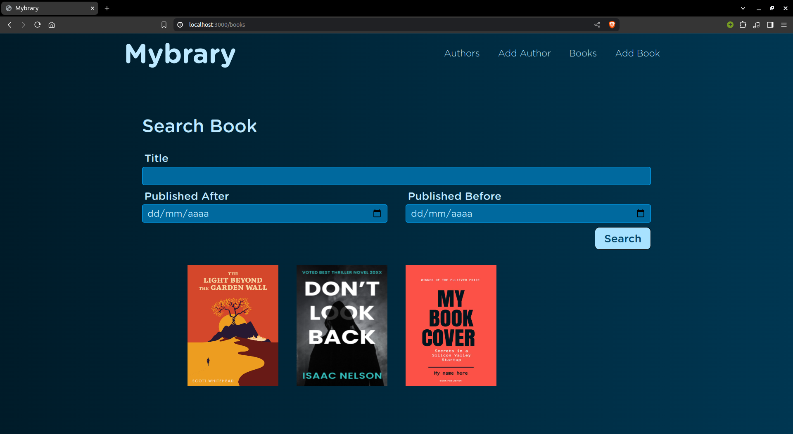

# Mybrary

Projeto criado a partir dos vídeos do canal [Web Dev Simplified](https://www.youtube.com/@WebDevSimplified).

O projeto foi feito com back-end em Node.js (Express) e banco de dados MongoDB.

Recursos:

- Adicionar, editar e remover autores de livros.

- Adicionar, editar e remover livros.

- Ver livros criados por um autor.

- Pesquisar autores e livros já adicionados no site.

# Screenshot

